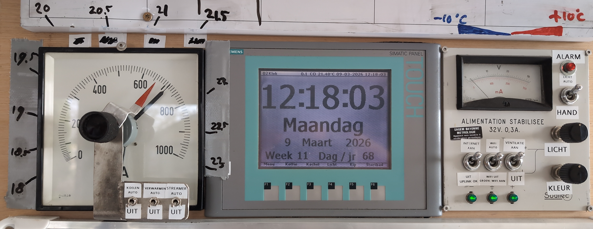
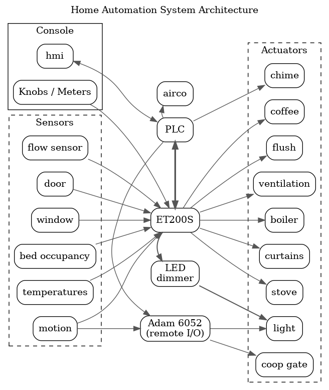

# Home Automation System (S7-1200)

A custom-built home automation system focused on reducing cognitive load through predictable, low-interaction behavior.

The system integrates lighting, heating, appliances, and presence detection into a single coherent control system, built around industrial PLC hardware.

---

## Overview

This project is not aimed at feature richness, but at **reducing the need to think about everyday actions**.

Instead of requiring user input, the system:

* anticipates behavior based on context
* operates consistently and predictably
* minimizes interruptions and sudden changes

The result is a living environment that requires less manual interaction and fewer decisions.

---

## Architecture

* **PLC:** Siemens S7-1200
* **Distributed I/O:** Siemens ET200S, ADAM-6052
* **HMI:** KTP600 Basic Mono, and knobs and meters for status and manual overrides
* **Custom hardware:** Multiple custom-built interface and control boards
* **Operation:** Fully offline, no cloud dependencies. Fully wired, no wireless communication.

---

## Design Principles

* **Predictability over flexibility** Behavior is stable and consistent over time
* **Minimal interaction** Most actions are automatic
* **Context awareness** System reacts to presence, time of day, and usage patterns
* **Quiet operation** Mechanical and electrical noise are minimized
* **Energy-aware behavior** Systems adapt to occupancy and demand

---

## Key Features

### Lighting

* Automatic lighting when entering rooms (e.g. opening doors)
* Lights remain on while spaces are in use (no sudden darkness)
* Smooth fade-in / fade-out transitions
* Circadian rhythm lighting (warmer and dimmer in the evening)
* Computer screens act as virtual light sources
* Bed occupancy turns light off

---

### Heating & Stove Control

* Computer-controlled coal stove:

  * Adjustable air intake (mechanical + fan-assisted)
  * Temperature-based regulation
  * Analog thermostat feedback for direct observability

* Heat recovery:

  * Exhaust heat transferred into central heating system

* Boiler control:

  * Low-temperature baseline curve
  * On-demand boost for showering

---

### Stove Optimization

To enable stable low-power operation, the stove was modified with internal ceramic insulation.

Goal:

* maintain a steady low burn rate

Effect:

* improved combustion stability
* reduced internal heat loss
* better control at low output levels

---

### Presence & Behavior Automation

* Toilet flushes automatically after leaving
* Doorbell indicates presence (home/away)
* Chicken coop opens and closes at preprogrammed times
* Shower detection based on:

  * presence
  * closed doors
  * water usage

Triggers:

* ventilation adjustments
* curtain control

---

### Appliances & Convenience

* Coffee machine finishes at a configured time
* Printer power enabled automatically before use
* Central HMI provides overrides and system visibility

---

### Noise & Comfort Optimization

* Fridge operation biased toward times when nobody is present
* Solid-state switching used where possible to reduce noise

---

## Communication & Integration

* Proprietary Daikin S21 protocol implemented directly on the PLC
* Custom-built serial multiplexer for multi-device communication
* Integration of external systems without reliance on external controllers

---

## Custom Hardware

The system includes several custom-built components:

* LED dimmers (down to ~0.1% brightness)

  
* Serial communication interfaces

  
* Control boards for distributed logic
* Analog and digital signal conditioning

These are implemented using discrete components and perfboard-based designs.

---

## Safety

* CO detection:

  * Acoustic alarm to ensure user intervention
  * Ventilation is adjusted automatically
  * User action is required (e.g. checking stove, opening windows)

* Boiler hygiene:

  * Weekly high-temperature disinfection cycle (legionella prevention)

---

## Notes

* The system evolved over time based on real-world usage
* Functionality prioritizes reliability and usability over complexity

---

## Summary

This project demonstrates how industrial control systems and custom hardware can be combined to create a **predictable, low-effort living environment**.

Rather than maximizing automation features, the focus is on:

* reducing cognitive load
* maintaining consistent behavior
* integrating multiple subsystems into a single coherent design

